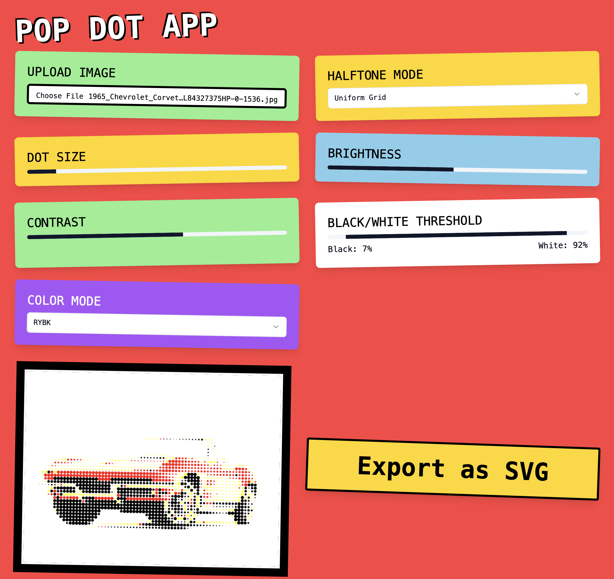

# Pop Dot App

See a working demo here: https://pop-dot-app.vercel.app/

This web app converts an image to a halftone, e.g. for plotting on a plotter. Black and white is the default, but there are aslo CMYK and RYBK (red, yellow, blue and black) modes available.

In the CMYK/RBYK mode the app will try to match the color as closely is it can, but will not in general mix the colors as it does not look good.  No dithering is applied too as that does not seem to look good either.

For all modes brightness, contrast and threshold sliders can adjust how the output image looks like.

In addition to the uniform grid halftone, Pop Dot App supports circle packing, where dots are not laid out on the uniform grid.

Enjoy!
